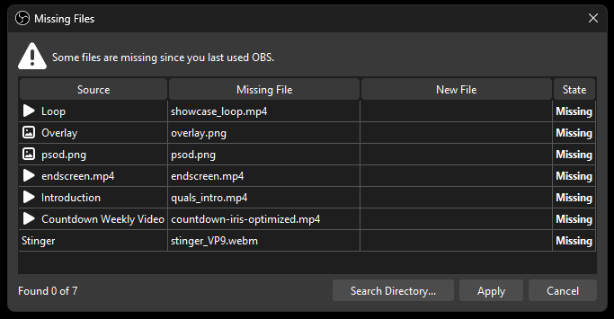
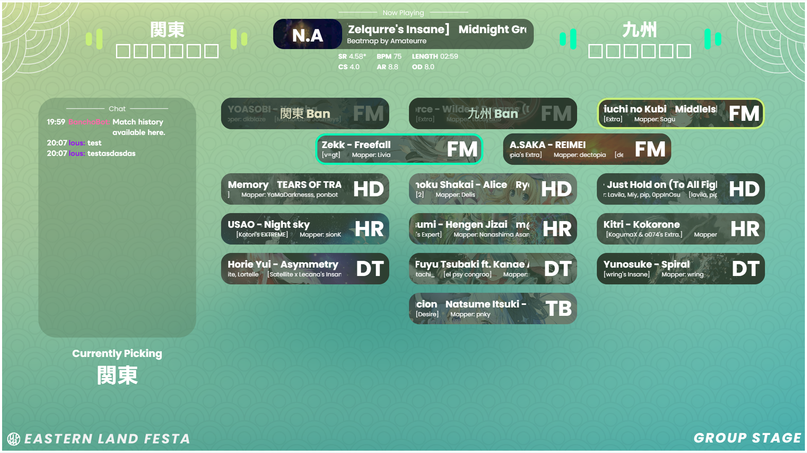
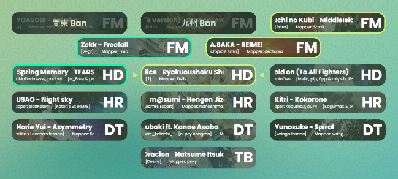
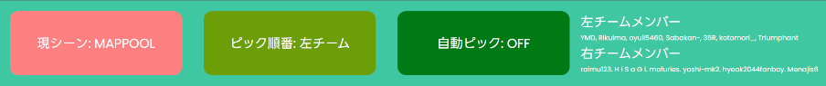
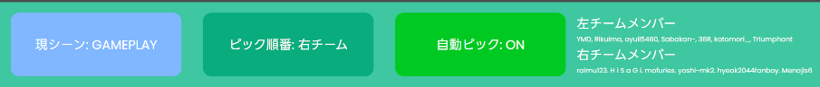
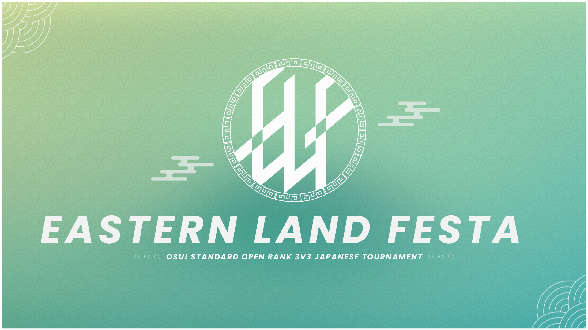
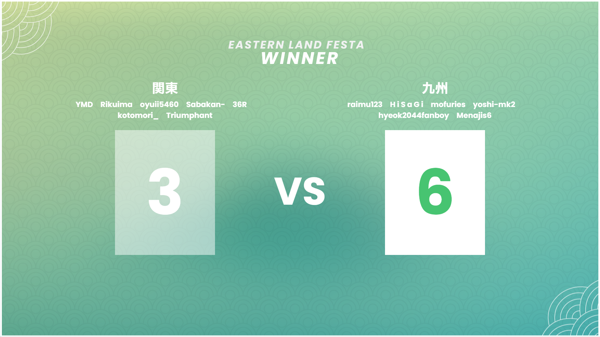
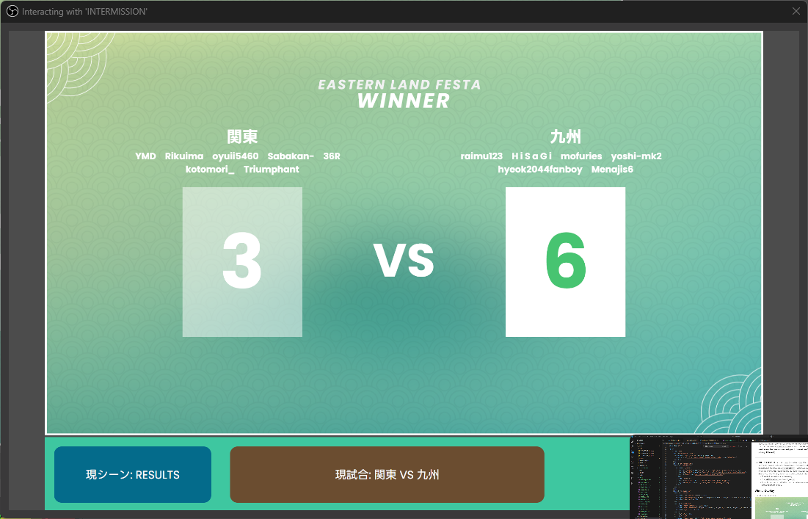

# elf-stream
The main repository for the overlay of Eastern Land Festa, meant to run on tosu

___
# ENGLISH VERSION
___

### OBS Scene
The scene file is located in `elf-stream/_data/obs/`. The JSON file will be named **ELF_OBS_day_month_X** in the directory. Just pick the one with the latest version when importing into OBS

After importing the scene file, you should be prompted with a Missing Files tab.

Click on "Search Directory..." and select the `_shared_assets` folder in the project files. If it doesn't fully link all the missing files, try selecting the subfolders in the `_shared_assets` folder. After that, just click on Apply and the assets should be displayed.

### Tosu & Stream Directory
**[Project link for tosu](https://github.com/KotRikD/tosu#readme)**

To install the application, just download the latest release and export `tosu.exe` in whatever directory you want. Then in that same directory, create a static folder and run `tosu.exe`.

To properly import all overlays, download the latest release of this project and import it into the static folder. If you have an osu! client open, the OBS scenes should properly reflect the scenes. If there's any issue projecting the overlay on OBS, you can try finding the URL link of the individual overlays by scrolling down to the target overlay and clicking on the URL parameter.

If you open the link in the browser and it doesn't project anything, contact `louscmh` immediately. If not, then OBS should be able to project the browser source.

### Match Overlay
Example scene for reference

**IMPORTANT SETUP STEP**
The showcase overlay uses the following JSON to function:
- `beatmaps.json`
- `api.json`
- `teams.json`
- `dates.json`

For the mappool overlay to properly function & display both player & beatmap details, it will require you to insert an API key into `_data/api.json`.

You can find your own osu! API at https://osu.ppy.sh/home/account/edit#legacy-api, make sure to not reveal this api key to anyone else (otherwise they will have the potential to steal your credentials)

Within the Match Overlay there are a few interactable elemenets that requires the streamer to manually click on them to properly display what is being picked, who is it being picked by, moving on to the next map etc. To interact with the Overlay, click on the `Interact` Button when selecting the Mappool Overlay in OBS.

**INTERACTING WITH THE BEATMAPS**

While hovering on any of the beatmaps,
- Left Click to pick for **Left Team**
- Right Click to pick for **Right Team**
- Shift + Left Click to ban for **Left Team** (Note: there can only be 2 banned maps in the overlay at once! (as per the tourney rules))
- Shift + Right Click to ban for **Right Team** (Note: there can only be 2 banned maps in the overlay at once! (as per the tourney rules))
- Ctrl + Left Click to retract any actions (This will retract the pulsing pick aswell)

**INTERACTING WITH THE CONTROL PANEL**

In order from left to right:
____
- **現シーン (CURRENT SCENE)**: Has 2 modes: `MAPPOOL` (default) and `GAMEPLAY`. When clicking on this button, the `MAPPOOL` scene above will change to show the `GAMEPLAY` below and vice versa (try this on obs to actually see it!). **This will automatically trigger by itself once both players enter the map, and will automatically trigger again 30 seconds after the results screen has been shown. (if you switch manually before then nothing happens)**
____
- **ピック順番 (PICK ORDER)**: Has 3 modes: `NOT AVAILABLE` (default), `LEFT TEAM` and `RIGHT TEAM`. In `NOT AVAILABLE` mode, clicking on the button will do nothing, as you will require to ban 2 maps before being able to interact with it. Once you banned 2 maps, the button will switch to either `LEFT TEAM` or `RIGHT TEAM` depending on which team bans the 2nd map (indicating they also go first). Upon clicking the button in any of the 2 aforementioned modes will switch the mode to the other team. This concerns how the `AUTOPICK BUTTON` functions. **This will automatically trigger by itself once result screen has been shown, moving on to the next team's turn. (This will retract the pulsing pick aswell)**
____
- **自動ピック (AUTO PICK)**: Has 2 modes: `OFF` (default) and `ON`. When turned to `ON`, whenever the client switches to any map in the pool, the overlay will automatically detect the map and pick it based on which team is showing on the `ピック順番ボタン`. So for example if it is currently `TEAM 2`'s turn to pick and they pick `RC2`, upon changing the map in the client the overlay will automatically pick `RC2` for you. This will only toggle if the following conditions has been satisfied:
    - There is 2 banned maps in the overlay
    - The `AUTO PICK` has been toggle `ON`
    - From the moment the button has been turned on, a new map **that is part of the pool** has been switched to in the MP.

### Intermission Overlay
Example scene for reference

### Winner Overlay
Example scene for reference

This scene is part of the Intermission overlay. If you want to return back to the intermission screen, click `INTERACT` on the `INTERMISSION` Overlay, and click on the `現シーン (CURRENT SCENE)`.

(Note that once a team wins, this overlay will automatically switch to results)

___
# JAPANESE VERSION
___

### OBS Scene
シーンファイルは `elf-stream/_data/obs/` に **ELF_OBS_日_月_X**という名前になります。インポートする際には、最新バージョンのものを選んでください。

インポートすると、「Missing Files」タブが表示されます。

「Search Directory...」をクリックし、ファイル内の `_shared_assets` フォルダを選択します。 リンクされない場合は、`_shared_assets` フォルダ内のサブフォルダを選択してみてください。 その後、「Apply」をクリックすると、シーンの内容が反映されます。

### Tosu & Stream Directory
**[tosuのプロジェクトリンク](https://github.com/KotRikD/tosu#readme)**

tosuをインストールするには、最新リリースをダウンロードし、好きなディレクトリに `tosu.exe` をエクスポートします。同じディレクトリに static フォルダを作成し、`tosu.exe` を実行します。

プロジェクトを適切にインポートするには、GitHubに最新リリースをダウンロードし、`static`フォルダにインポートします。osu! クライアントが開いている場合、OBSにシーンは適切に反映されるです。何かうまくいかない場合は、すぐに `louscmh` までご連絡ください。

### Match Overlay
参考用シーン例

**重要な設定手順**
このオーバーレイは、機能するために以下のJSONを使用します。
- `beatmaps.json`
- `api.json`
- `teams.json`
- `dates.json`

Beatmapの詳細を適切に表示するために、APIキーを `_data/api.json` に挿入する必要があります。

自身のAPIキーは https://osu.ppy.sh/home/account/edit#legacy-api で作ることができます。 このAPIキーを他の誰にも開示しないようにしてください。

オーバーレイ内には、配信担当者が手動でクリックして、試合内にいくつかの活動を適切に表示する必要があります。行うには、Sourcesで「MATCH」を選択したときに「Interact」ボタンをクリックします。

**Beatmapの操作方法**

Beatmap上にホバリングさせている間、
- 左クリックで**左チーム**を選択
- 右クリックで**右チーム**を選択
- Shift + 左クリックで**左チーム**のバン
- Shift + 右クリックで**みぎチーム**のバン
- Ctrlキー+左クリックで、アクションを元に戻す

(注意：オーバーレイでバンできるマップは一度に2つまでです！)

**コントロールパネルとの操作方法**

左から右へ順に：
____
- **現シーンボタン**: 2つのモードがあります:`MAPPOOL`(デフォルト)と`GAMEPLAY`。このボタンをクリックすると、`MAPPOOL`のシーンが`GAMEPLAY`に切り替わります (逆も同様です)。 **Beatmapに入ると、自動的に`GAMEPLAY`に切り替わりが作動します。また、Beatmap結果画面が表示されてから30秒後に、自動的に`MAPPOOL`に切り替わりが再び作動します。（それまでに手動で切り替えた場合は、何も起こりません）**
____
- **ピック順番ボタン**: 3つのモードがあります: `利用不可`(デフォル)、`左チーム`、`右チーム`。 `利用不可`モードでは、ボタンをクリックしても何も起こりません。2つのマップをバンすると、ボタンは、二番目のマップをバンしたチームに応じて、`左チーム`または`右チーム`に切り替わります。この段階にボタンをクリックすると、モードがもう一方のチームに切り替わります。**Beatmap結果画面が表示される場合、次のチームの順番に移行し、自動的に切り替わりされます。**
____
- **自動ピックボタン**: 2つのモードがあります:`ON`(デフォルト)と`OFF`。 `ON`に設定すると, osu!が試合のMappool内のBeatmapに切り替えるたびに, オーバーレイがピックを自動的に認識し、`ピック順番ボタン`でのチームに基づいてピックを選択します。例えば、ピック順番が左チームので、左チームがNM1を選択した場合、osu!でBeatmapを変更すると、オーバーレイが自動的にNM1を選択します。これは、以下の条件が満たされた場合にのみ切り替われます。
    - オーバーレイに2つバンがあります。
    - `自動ピックボタン`のモードは`ON`
    - ボタンが`ON`になった瞬間から、**Mappool内に含まれている**Beatmapがosu!で切り替わっています。

### Intermission Overlay
参考用シーン例

### Winner Overlay
参考用シーン例

このシーンは`INTERMISSION`のオーバーレイに`現シーン: STARTING`のボタンをクリックすると表示できます。元に戻りたい場合は、再びに`現シーン`のボタンをクリックしてください。

(注意：いずれかのチームが勝利した場合、このオーバーレイは自動的に`WINNER`のシーンに切り替わります)

